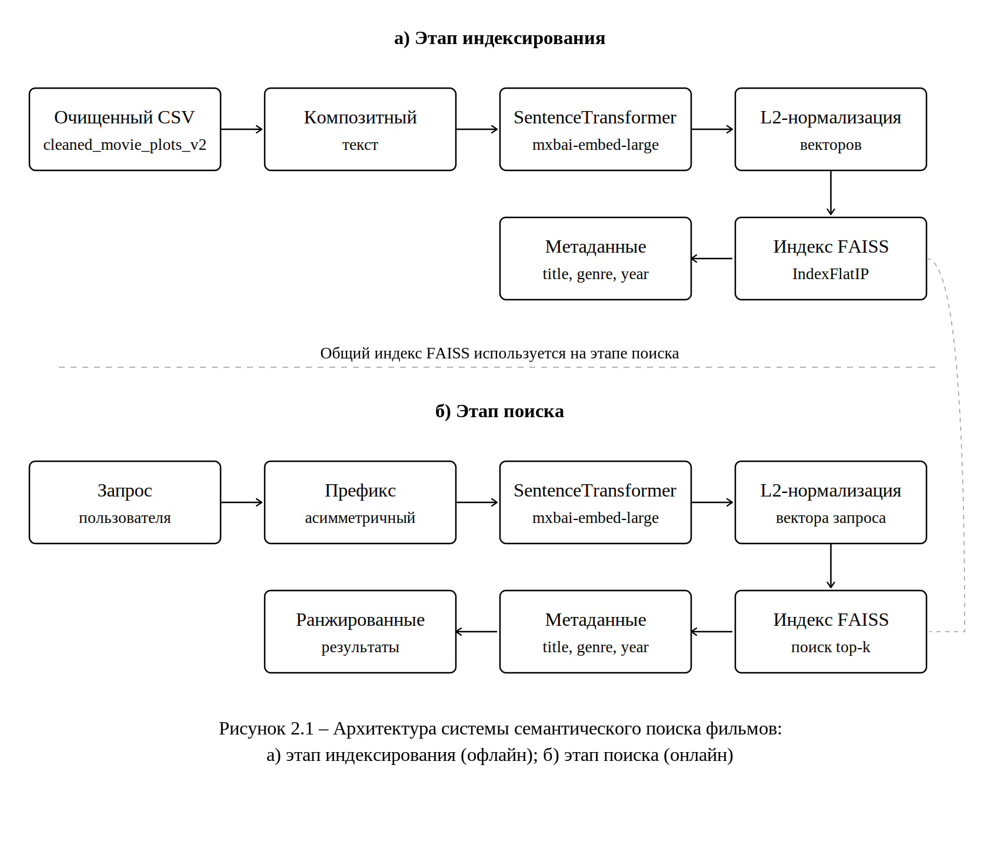

# Movie Semantic Search

Find a movie by describing its plot in your own words.

Bachelor's thesis project (Ural Federal University, 2026): a dense-retrieval system over 32,364 Wikipedia movie plots built with `mxbai-embed-large-v1` sentence embeddings, FAISS and FastAPI, then improved with LoRA fine-tuning and evaluated against BM25 and a cross-encoder reranker on a labelled 394-query test set.

> **Кратко (RU).** Прототип семантического поиска фильмов по свободному описанию сюжета: эмбеддинги `mxbai-embed-large-v1`, индекс FAISS, сервис на FastAPI. Модель дообучена методом LoRA (Hit@10 вырос с 52,0 % до 56,6 %), проведено сравнение с BM25 и кросс-энкодером на тестовой выборке из 394 запросов. Два неудачных эксперимента (полное дообучение и реранкер) разобраны в разделе *What went wrong*. Выпускная квалификационная работа УрФУ, 2026.

## How it works



1. **Data.** The Kaggle *Wikipedia Movie Plots with Plot Summaries* dump is cleaned in two passes: notebook 01 drops rows with missing fields and normalises text; `scripts/clean_dataset.py` strips citation markers, deduplicates by canonical title + year, builds one composite document per movie (`Title / Genre / Summary / Plot`) and flags suspicious rows. Result: 32,364 movies.
2. **Indexing.** Every composite document is encoded with `mixedbread-ai/mxbai-embed-large-v1` (1024-d), L2-normalised and stored in a `faiss.IndexFlatIP` index, so inner product equals cosine similarity and search is exact.
3. **Search.** The query gets mxbai's asymmetric retrieval prefix, is embedded by the same model, and the FastAPI service returns the top-k movies with title, year, genre, summary and similarity.
4. **Fine-tuning.** A LoRA adapter (rank 16 on the query/key/value projections, 2.4 M of 335 M parameters trainable) is trained on LLM-generated query → plot pairs with `MultipleNegativesRankingLoss`, on CPU. The corpus is re-encoded with the adapted model.

## Results

Test set: 98 movies × 4 query types = 394 LLM-generated queries, versioned in `data/eval/test_set_394.csv`. A query is a hit at rank *k* if the correct title is among the top-*k* results (fuzzy title match, ratio ≥ 0.85). Query types: `oracle` reuses the plot's wording, `naturalistic` is a short keyword query, `conversational` is a "that movie where…" query, `vague` is a one-sentence theme.

| Model | Hit@1 | Hit@5 | Hit@10 | MRR |
|---|---|---|---|---|
| BM25 (keyword baseline) | 37.6% | 45.7% | 49.5% | 0.412 |
| mxbai-embed-large-v1, no fine-tuning | 37.3% | 46.7% | 52.0% | 0.415 |
| Full fine-tune (all weights) | 11.2% | 23.6% | 37.8% | 0.172 |
| LoRA v1 | 39.6% | 51.5% | 56.3% | 0.444 |
| **LoRA v2 (final system)** | **39.6%** | **51.5%** | **56.6%** | **0.445** |
| LoRA v2 + cross-encoder reranker | 10.7% | 24.1% | 37.3% | 0.171 |

Hit@1 / Hit@10 by query type:

| Model | oracle | naturalistic | conversational | vague |
|---|---|---|---|---|
| BM25 | 100% / 100% | 28% / 50% | 20% / 43% | 1% / 4% |
| mxbai, no fine-tuning | 74% / 91% | 32% / 51% | 39% / 58% | 4% / 7% |
| LoRA v2 | 81% / 96% | 35% / 58% | 38% / 63% | 4% / 8% |

What the numbers say:

- LoRA fine-tuning gives a modest but consistent gain over the base model: +2.3 pp Hit@1, +4.6 pp Hit@10, +0.03 MRR. It fixed 16 top-1 misses of the base model and broke 7.
- BM25 is perfect on `oracle` queries because they reuse the plot's exact words, but it loses badly on paraphrased `conversational` queries (20% vs 38% Hit@1). That gap is what dense retrieval is for.
- `vague` queries ("a family's simple act of kindness leads to unexpected love during wartime") are essentially unsolved by every method. One sentence of theme does not identify one film out of 32 thousand.

Regenerate both tables with `python scripts/summarize_results.py`. Per-query results for every run are in `results/`.

## What went wrong along the way

Two experiments made the system much worse. Both stay in the repository because working out why was most of the learning.

**Full fine-tuning collapsed the model** (notebook 04). The first attempt fine-tuned all 335 M parameters of mxbai on 3–5 K synthetic query/plot pairs with batch size 4 on CPU. Hit@1 fell from 37.3% to 11.2%. The clearest symptom: `oracle` queries, which the base model solved 74% of the time, dropped to 18%, so the model had not just failed to learn the new task, it had lost its general retrieval ability. With every weight trainable, three in-batch negatives per step and only synthetic queries as supervision, it overfit the query style. Fix: freeze the base model and train a LoRA adapter instead (notebook 06), which kept the base quality and added the gains above.

**The cross-encoder reranker destroyed the ranking** (`src/reranker.py`). A `ms-marco-MiniLM-L6-v2` cross-encoder fine-tuned on 8 K query/plot pairs re-ordered LoRA v2's top-10 and pushed Hit@1 from 39.6% to 10.7%, breaking 120 queries the retriever had already answered correctly. The most likely cause: the candidate list handed to the reranker contained only titles, so at inference the model compared the query with a bare title although it had been trained on query-versus-plot pairs. The reranker was dropped from the final system, and the module now takes the candidate text field explicitly.

Dates, the runs that did not make the table and open problems are in [docs/experiments.md](docs/experiments.md).

## Repository layout

```
app/          FastAPI service: main.py (endpoints), retrieval.py (model + FAISS index), static/index.html (UI)
notebooks/    01–09, numbered in pipeline order (see below)
scripts/      clean_dataset.py (second cleaning pass), summarize_results.py (README tables)
src/          reranker.py — cross-encoder experiment, not used by the app
data/         datasets (ignored) + data/eval/test_set_394.csv (versioned)
results/      per-query evaluation CSVs for every run in the tables above
docs/         architecture diagram, experiment log
artifacts/    corpus embeddings and metadata (generated, ignored)
models/       LoRA adapters and the cross-encoder (generated, ignored)
```

## Quick start

Requirements: Python 3.10+, ~4 GB RAM, no GPU needed.

```bash
git clone https://github.com/DarkinStar/diploma_movies.git
cd diploma_movies
python -m venv .venv
source .venv/bin/activate        # Windows: .venv\Scripts\activate
pip install -r requirements.txt
```

The corpus embeddings are not in Git (they are 130 MB of generated data). Build them once:

1. Download the dataset from Kaggle: [wikipedia-movie-plots-with-plot-summaries](https://www.kaggle.com/datasets/gabrieltardochi/wikipedia-movie-plots-with-plot-summaries) and put the CSV in `data/`.
2. Run `notebooks/01_dataset_setup.ipynb`, then `python scripts/clean_dataset.py`.
3. Run `notebooks/03_build_index.ipynb`. It downloads `mxbai-embed-large-v1` (~1.3 GB) and encodes the 32 K documents, which takes a few hours on CPU. Output: `artifacts/embeddings_mxbai_base.npy` and `artifacts/metadata.pkl`.

Then start the service from the repository root:

```bash
uvicorn app.main:app --reload
```

Open <http://127.0.0.1:8000> for the UI, or call the API directly:

```bash
curl -X POST http://127.0.0.1:8000/search \
     -H "Content-Type: application/json" \
     -d '{"text": "a shark terrorizes a beach town", "top_k": 5}'
```

`GET /health` reports which model and artifacts are loaded. To serve the fine-tuned model, train an adapter (notebooks 05 → 06), re-encode the corpus with it (notebook 03) and point the service at both through `.env` (see `.env.example`). An optional `POST /judge` endpoint asks an LLM through OpenRouter how relevant the returned titles look; it is off unless `OPENROUTER_API_KEY` is set and is not part of the evaluation.

## Reproducing the experiments

| # | Notebook | What it does | Needs |
|---|---|---|---|
| 01 | `01_dataset_setup` | Kaggle dump → `data/cleaned_movie_plots.csv` | dataset |
| 02 | `02_dataset_exploration` | decade / genre statistics, candidate title lists | 01 |
| 03 | `03_build_index` | corpus embeddings + metadata for any model (base or LoRA) | 01 |
| 04 | `04_synthetic_queries_and_full_finetune` | LLM query generation; the full fine-tune that collapsed | `GROQ_API_KEY` |
| 05 | `05_mine_hard_negatives` | top-5 retrieval + LLM ranking → hard-negative training pairs | 03, `GROQ_API_KEY` |
| 06 | `06_finetune_lora` | LoRA adapter training on CPU | 05 |
| 07 | `07_eval_baseline` | Hit@K / MRR of the base model | 03 |
| 08 | `08_eval_lora` | Hit@K / MRR of LoRA v1 and v2, comparison with 07 | 03, 06, 07 |
| 09 | `09_eval_bm25` | BM25 keyword baseline on the same test set | 01 |

Only `data/eval/test_set_394.csv` and the `results/` CSVs are versioned, so the tables above can be re-derived without running any model.

## Thesis

«Разработка прототипа системы семантического поиска фильмов на основе векторных эмбеддингов», Уральский федеральный университет, направление 09.03.03 Прикладная информатика, 2026. The thesis text is not part of this repository.

## License

MIT, see [LICENSE](LICENSE). The movie plots come from Wikipedia via the Kaggle dataset linked above and keep their original licence.
